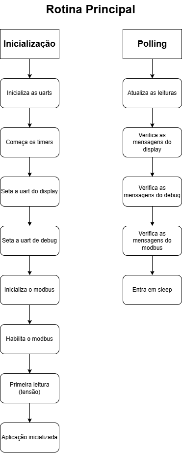
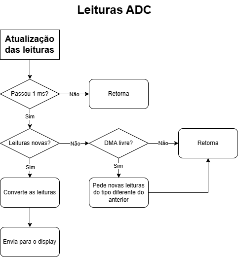
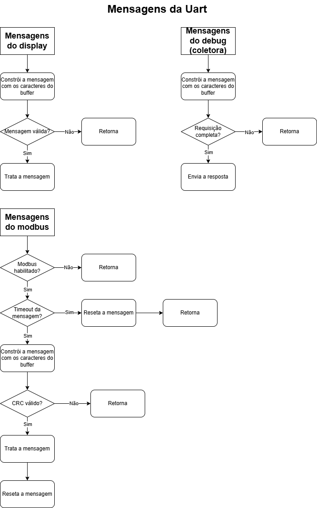

# Jiga

Repositório destinado ao versionamento do firmware da placa e display da Jiga.

O objetivo da placa é fazer a coleta de 10 leituras de tensão e corrente. Ela faz isso a partir de 10 canais de ADC e um interruptor que seleciona se as leituras serão de tensão ou corrente.

#

## Descritivo da Lógica de Funcionamento

#

### Rotina Principal

Na rotina principal, é feita a inicialição dos periféricos e o setup das uarts, bem como a primeira requisição de leitura por DMA. A primeira leitura feita é de tensão.

Então, no loop, as medições são atualizadas a cada milissegundo e é feito o tratamento de mensagens das uarts.

Finalmente, o microcontrolador entra em sleep.

  

#

### Atualização de Leituras

A atualização das leituras é feita a cada milissegundo, sempre trocando qual o tipo de leitura é feita. Ou seja, se for feita uma leitura de tensão, após um milissegundo, será feita uma leitura de corrente, então, depois de outro milissegundo, será feita outra leitura de tensão e assim segue.

Sempre que há uma leitura nova, ela é convertida e enviada para o display.

  

#

### Tratamento de Mensagens das Uarts

O tratamento das mensagens das uarts é feito sequenciamente, iniciando com a uart do display, então a de debug e, finalmente, a do modbus. As funções de tratamento fazem a construção, a validação e a classificação das mensagens (tipo de requisição, tipo de erro, etc).

As mesmas funções também executam a resposta. Isso foi feito assim, pois, por agora, as respostas são bastante simples e imediatas, caso elas se tornem mais complexas, pode-se desenvolver uma lógica mais organizada.

  

#

## Firmware

As implementações estão concentradas no arquivo app.c. Os outros arquivos servem apenas como bibliotecas.

Em resumo, o programa faz a leitura dos canais ADC por DMA, envia os resultados para o display, então troca o tipo de leitura (tensão ou corrente) e repete o processo a cada 1 ms.
Além disso, ele também recebe as mensagens de erro do display e as classifica (atualmente apenas em "buffer overflow" ou "invalid variable"); ainda não foi feito nenhum
tratamento para esses erros.

#

### App

Faz a inicialização e tratamento do programa. Idealmente, não é incluido em outros módulos, já que faz a junção de todos eles.

Também define as callbacks das interrupções de ADC, timer e uarts.

### Enums

| Enum | Componentes | Descrição |
| --- | --- | --- |
| `reading_t` | <ul><li>`READ_VOLTAGE` <li>`READ_CURRENT` | Tipos de leitura do ADC. |
| `displayOpcodes_t` | <ul><li>`SET_AS_MASTER` | Opcodes do display. |
| `uartBaudRate_t` | <ul><li>`BAUD_RATE_9600` <li>`BAUD_RATE_19200` <li>`BAUD_RATE_115200` | Baudrates usados. |
| `uartStopBits_t` | <ul><li>`STOP_BITS_0_5` <li>`STOP_BITS_1` <li>`STOP_BITS_1_5` <li>`STOP_BITS_2` | Número de stop bits usados. |
| `uartParity_t` | <ul><li>`PARITY_NONE` <li>`PARITY_EVEN` <li>`PARITY_ODD` | Paridade usada. |

### Funções

| Função | Retorno | Parâmetros | Descrição |
| --- | --- | --- | --- |
| **APP_InitUarts** | 
`void`
 | 
`void`
 | Faz a inicialização das uarts de display, debug e modbus, bem como de seus ring buffers. |
| **APP_InitTimers** | 
`void`
 | 
`void`
 | Faz a inicialização do timer 6 (1 ms). |
| **APP_InitModbus** | 
`void`
 | 
`void`
 | Faz a inicialização do modbus. |
| **APP_EnableSupplies** | 
`void`
 | 
<ul><li>`uint8_t supplyFlags:` byte com as flags das fontes que devem ser ligadas. | Liga as fontes especificadas na placa. |
| **APP_DisableSupplies** | 
`void`
 | 
<ul><li>`uint8_t supplyFlags:` byte com as flags das fontes que devem ser desligadas. | Desliga as fontes especificadas na placa. |
| **APP_StartAdcReadDma** | 
`void`
 | <ul><li>`uint16_t* readsBuffer:` buffer onde as leituras são armazenadas <li>`reading_t rypeOfRead:` escolhe se a leitura é de tensão ou corrente | Inicia a leitura por DMA e seta a variável global que indica o tipo de leitura sendo feito. |
| **APP_UpdateReads** | 
`void`
 | 
`void`
 | Verifica se há novas leituras e, caso sim, as envia para o display. Também faz a requisição de uma nova leitura do outro tipo. |
| **APP_RequestReads** | 
`void`
 | 
`void`
 | Faz a requisição de leituras de outras placas. |
| **APP_UpdateDisplay** | 
`void`
 | 
`void`
 | Faz o envio das leituras da placa para o display. |
| **APP_TreatDisplayMessage** | 
`void`
 | 
`void`
 | Faz o tratamento das mensagens enviads pelo display. |
| **APP_TreatDebugMessage** | 
`void`
 | 
`void`
 | Faz o tratamento das mensagens enviads pela porta de debug. |
| **APP_TreatModbusMessage** | 
`void`
 | 
`void`
 | Faz o tratamento das mensagens enviads pelo modbus. |
| **APP_TreatMasterRequest** | 
`void`
 | <ul><li>`string* request:` mensagem recebida pelo modbus | Faz o tratamento das mensagens enviads pelo modbus como escravo. |
| **APP_TreatSlaveResponse** | 
`void`
 | <ul><li>`string* response:` mensagem recebida pelo modbus | Faz o tratamento das mensagens enviads pelo modbus como mestre. |
| **APP_EnableUartInterrupt** | 
`void`
 | <ul><li>`UART_HandleTypeDef* huart:` huart que deve ser ligada | Ativa o recebimento da uart por interrupção. |
| **APP_DisableUartInterrupt** | 
`void`
 | <ul><li>`UART_HandleTypeDef* huart:` huart que deve ser desligada | Desliga o recebimento da uart por interrupção. |
| **APP_UpdateUartConfigs** | 
`void`
 | <ul><li>`UART_HandleTypeDef* huart:` huart que deve ser alterada <li>`uint8_t* uartBuffer:` buffer da uart <li>`uartBaudRate_t:` baudrate <li>`uartStopBits_t:` quantidade de stop bits <li>`parity:` paridade | Reinicia a uart com novas configurações. |
| **APP_SendLog** | 
`void`
 | 
`void`
 | Faz o envio de uma mensagem com timestamp e as  leituras da placa na porta de debug. |
| **APP_SendPeriodicReads** | 
`void`
 | 
`void`
 | Faz o envio de uma mensagem com timestamp e as  leituras da placa na porta de debug. |
| **APP_SetRtcTime** | 
`void`
 | <ul><li>`RTC_HandleTypeDef* hrtc:` estrutura do RTC <li>`uint8_t seconds:` segundos para setar <li>`uint8_t minutes:` minutos para setar <li>`uint8_t hours:` horas para setar | Seta um novo horário no RTC |
| **APP_SetRtcDate** | 
`void`
 | <ul><li>`RTC_HandleTypeDef* hrtc:` estrutura do RTC <li>`uint8_t day:` dia para setar <li>`uint8_t month:` mês para setar <li>`uint8_t year:` ano para setar | Seta uma nova data no RTC |
| **APP_AddRtcTimestampToString** | 
`void`
 | <ul><li>`string* String:` string de base <li>`RTC_HandleTypeDef* baseTime:` estrutura do RTC para adicionar | Adiciona o timestamp do RTC na string. |

### Callbacks das Interrupções

| Função | Origem |Descrição |
| --- | --- | --- |
| **HAL_ADC_ConvCpltCallback** | ADC | Seta a flag que indica que há uma nova leitura para ser enviada. |
| **HAL_UART_RxCpltCallback** | UART | Guarda o byte recebido e reseta a interrupção. |
| **HAL_TIM_PeriodElapsedCallback** | Timer | Aumenta a contagem dos contadores de tempo. |

#

## Comm

Cuida da comunicação de debug (coletora) da placa. Ainda precisa definir uma lista de códigos comuns entre as placas.

### Enums

| Nome | Constantes | Descrição |
| --- | --- | --- |
| `debugRequest_t` | <ul><li>`INCOMPLETE_REQUEST` <li>`INVALID_REQUEST` <li>`SEND_VOLTAGE_READS` <li>`SEND_CURRENT_READS` <li>`SEND_ALL_READS` <li>`SET_MODBUS_CONFIG` <li>`CHANGE_SCALE` <li>`LOGS` | Lista de requisições que podem ser feitas à placa. Provisória, passível de mudança. |
| `debugAckSignals_t` | <ul><li>`NACK` = 1 <li>`ACK_VOLTAGE_READS` <li>`ACK_CURRENT_READS` <li>`ACK_ALL_READS` <li>`ACK_MODBUS_CONFIG` <li>`ACK_CHANGE_SCALE` <li>`ACK_LOGS` = 22 | Lista de sinais de resposta às respectivas requisições. Provisória, passível de mudança. |

### Funções

| Função | Retorno | Parâmetros | Descrição |
| --- | --- | --- | --- |
| `COMM_Begin` | 
`void`
 | <ul><li>`UART_HandleTypeDef *huart:` endereço da uart de debug | Seta a uart passada para o envio das mensagens. |
| `COMM_SendStartPacket` | 
`void`
 | 
`void`
 | Envia os bytes que sinalizam o inínio da mensagem. Atualmente `##` (`0x23` `0x23`). |
| `COMM_SendEndPacket` | 
`void`
 | 
`void`
 | Envia os bytes que sinalizam o fim da mensagem. Atualmente `@` (`0x40`). |
| `COMM_SendAck` | 
`void`
 | <ul><li>`debugAckSignals_t ack:` sinal de reconhecimento a enviar | Envia o byte de resposta da requisição. |
| `COMM_SendValues8Bits` | 
`void`
 | <ul><li>`uint8_t *values:` buffer com os valores <li>`uint16_t length:` quantidade de valores | Envia valores de 8 bits pela uart de debug. |
| `COMM_SendValues16Bits` | 
`void`
 | <ul><li>`uint16_t *values:` buffer com os valores <li>`uint16_t length:` quantidade de valores | Envia valores de 16 bits pela uart de debug. |
| `COMM_SendValues32Bits` | 
`void`
 | <ul><li>`uint32_t *values:` buffer com os valores <li>`uint16_t length:` quantidade de valores | Envia valores de 32 bits pela uart de debug. |
| `COMM_SendString` | 
`void`
 | <ul><li>`string *message:` endereço da string | Envia uma string pela uart de debug. |
| `COMM_SendChar` | 
`void`
 | <ul><li>`uint8_t *buffer:` buffer com caracteres <li>`uint16_t length:` quantidade de caracteres | Envia caracteres pela usart de debug. |
| `COMM_TreatResponse` | `debugRequest_t:` qual requisição feita | <ul><li>`string *message:` mensagem de debug | Faz a interpretação de uma mensagem chegada pela uart de debug. |

#

  

  
## Modbus

Faz a comunicação por modbus. Trata do envio e verificação de mensagens.

### Enums

Referência: [embarcados.com.br/protocolo-modbus/](https://embarcados.com.br/protocolo-modbus/)
| Nome | Constantes | Descrição |
|---|---|---|
| `modbusStates_t` | <ul><li>`MODBUS_STARTING` = 0 <li>`MODBUS_IDLE` <li>`MODBUS_SENDING` <li>`MODBUS_RECEIVING` | Estados do modbus |
| `modbusOpcodes_t` | <ul><li>`READ_COILS` = 0x01  <li>`READ_DISCRETE_INPUTS`  <li>`READ_HOLDING_REGISTERS`  <li>`READ_INPUT_REGISTERS`  <li>`WRITE_SINGLE_COIL`  <li>`WRITE_SINGLE_HOLDING_REGISTER`  <li>`READ_EXCEPTION_STATUS`  <li>`DIAGNOSTICS`  <li>`GET_COMM_EVENT_COUNTER` = 0x0B  <li>`GET_COMM_EVENT_LOG`  <li>`WRITE_MULTIPLE_COILS` = 0x0F  <li>`WRITE_MULTIPLE_HOLDING_REGISTERS`  <li>`REPORT_SLAVE_ID`  <li>`READ_FILE_RECORD` = 0x14  <li>`WRITE_FILE_RECORD`  <li>`MASK_WRITE_REGISTER`  <li>`READ_WRITE_MULTIPLE_REGISTER`  <li>`READ_FIFO_QUEUE`  <li>`ENCAPSULATED_INTERFACE_TRANSPORT` = 0x2B | Opcodes disponíveis no protocolo modbus |
| `modbusError_t` | <ul><li>`MODBUS_NO_ERROR` = 0 <li>`MODBUS_INVALID_OPCODE` <li>`MODBUS_RESPONSE_ERROR` <li>`MODBUS_INVALID_REGISTER_ADDRESS` <li>`MODBUS_TIMEOUT` <li>`MODBUS_INVCORRECT_ID` <li>`MODBUS_INCORRECT_OPCODE` <li>`MODBUS_INCORRECT_FIRST_REGISTER` <li>`MODBUS_INCORRECT_QTT_REGISTERS` <li>`MODBUS_INCORRECT_CRC` | Erros de comunicação. `RESPONSE_ERROR` se trata de uma resposta de erro vinda do equipamento secundário, ela indica que a requisição feita pelo modbus é válida, mas não é aplicável para aquele equipamento. `INCORRECT` indica que uma parte da resposta não estava de acordo com o esperado pela coletora. `INVALID` indica que o tratamento de tal requisição ou resposta ainda não foi implementado ou não existe.

### Structs

| Nome | Componentes | Descrição |
|---|---|---|
| `modbusHandler_t` | <ul><li>`GPIO_TypeDef *sendReceivePort:` porta do pino que controla se o modbus envia ou recebe mensagens <li>`uint16_t sendReceivePin:` número do pino que controla se o modbus envia ou recebe mensagens <li>`UART_HandleTypeDef *modbusUart:` endereço da uart em que o modbus está conectado <li>`uint8_t deviceAddress:` endereço do dispositivo <li>`modbusStates_t modbusState:` estado do modbus <li>`uint8_t payloadBuffer[MODBUS_BUFFER_SIZE]:` buffer que armazena os bytes enviados pelo modbus <li>`uint8_t payloadIndex:` índice do buffer do modbus <li>`uint8_t requestId:` endereço de destino da última mensagem enviada <li>`modbusOpcodes_t opcode:` opcode da última mensagem enviada <li>`uint16_t firstRegister:` primeiro endereço da última mensagem enviada <li>`uint16_t qttRegisters:` quantidade de registros da última mensagem enviada <li>`uint32_t calculatedCRC:` CRC calculado a partir do `payloadBuffer` | Handler do modbus. Controla as mensagens enviadas e faz o tratamento das mensagens recebidas. |

### Funções

| Função | Retorno | Parâmetros | Descrição |
|---|---|---|---|
| `MODBUS_Begin` | 
`void`
 | <ul><li>`modbusHandler_t *modbusHandler:` endereço do handler do modbus <li>`GPIO_TypeDef *sendReceivePort:` porta do pino que controla se o modbus envia ou recebe mensagens <li>`uint16_t sendReceivePin:` número do pino que controla se o modbus envia ou recebe mensagens <li>`UART_HandleTypeDef *huart:` endereço da uart em que o modbus está conectado <li>`uint8_t deviceAddress:` endereço do dispositivo | Inicializa os componentes do handler do modbus. |
| `MODBUS_SetSendReceive` | 
`void`
 | <ul><li>`modbusHandler_t *modbusHandler:` endereço do handler do modbus <li>`sendOrReceive_t sendOrReceive:` estado para setar o modbus | Configura o pino de envio e recebimento do modbus para enviar ou receber dados. |
| `MODBUS_GetSendReceive` | `sendOrReceive_t:` `MODBUS_SET_RECEIVE` ou `MODBUS_SET_SEND` | <ul><li>`modbusHandler_t *modbusHandler:` endereço do handler do modbus |  informa se o modbus está enviando ou recebendo mensagens. |
| `MODBUS_VerifyMessage` | `modbusError_t:` tipo de erro encontrado | <ul><li>`uint8_t expectedSecondaryAddress:` endereço de origem experado <li>`uint8_t expectedOpcode:` opcode esperado <li>`uint16_t expectedFirstAdress:` primeiro endereço esperado <li>`uint16_t expectedNumberOfData:` quantidade de dados esperados <li>`uint8_t *messageBuffer:` buffer com a mensagem <li>`uint32_t messageLength:` tamanho da mensagem | Informa se a mensagem passada é válida e, se não for, acusa o motivo do erro. |
| `MODBUS_VerifyWithHandler` | `modbusError_t:` tipo de erro encontrado | <ul><li>`modbusHandler_t *modbusHandler:` endereço do handler do modbus <li>`uint8_t *messageBuffer:` buffer com a mensagem <li>`uint32_t messageLength:` tamanho da mensagem | Informa se a mensagem passada é válida de acordo com a última mensagem enviada e, se não for, acusa o motivo do erro. |
| `MODBUS_VerifyCrc` | `modbusError_t:` tipo de erro encontrado | <ul><li>`uint8_t *message:` buffer com a mensagem <li>`uint32_t length:` tamanho da mensagem | Informa se o crc da mensagem passada é válido. |
| `MODBUS_ReadCoils` | 
`void`
 | <ul><li>`modbusHandler_t *modbusHandler:` endereço do handler do modbus <li>`uint8_t secondaryAddress:` endereço do dispositivo de destino <li>`uint16_t firstCoilAddress:` endereço da primeira bobina desejada <li>`uint16_t numberOfCoils:` número de bobinas para ler | Faz uma requisição de leitura de bobinas. |
| `MODBUS_ReadInputRegisters` | 
`void`
 | <ul><li>`modbusHandler_t *modbusHandler:` endereço do handler do modbus <li>`uint8_t secondaryAddress:` endereço do dispositivo de destino <li>`uint16_t firstRegisterAddress:` endereço do primeiro input register desejado <li>`uint16_t numberOfRegisters:` número de input registers para ler | Faz uma requisição de leitura de input registers. |
| `MODBUS_ReadSingleHoldingRegister` | 
`void`
 | <ul><li>`modbusHandler_t *modbusHandler:` endereço do handler do modbus <li>`uint8_t secondaryAddress:` endereço do dispositivo de destino <li>`uint16_t firstRegisterAddress:` endereço do primeiro registrador desejado | Faz uma requisição de leitura de um registrador. |
| `MODBUS_ReadMultipleHoldingRegisters` | 
`void`
 | <ul><li>`modbusHandler_t *modbusHandler:` endereço do handler do modbus <li>`uint8_t secondaryAddress:` endereço do dispositivo de destino <li>`uint16_t firstRegisterAddress:` endereço do primeiro registrador desejado <li>`uint16_t numberOfRegisters:` número de registradores para ler <li>`registerBytes_t sizeOfRegisterBytes:` tamanho em bytes do registrador | Faz uma requisição de leitura de multiplos registradores. |
| `MODBUS_WriteSingleCoil` | 
`void`
 | <ul><li>`modbusHandler_t *modbusHandler:` endereço do handler do modbus <li>`uint8_t secondaryAddress:` endereço do dispositivo de destino <li>`uint16_t coilAddress:` endereço da bobina desejada <li>`uint8_t valueToWrite:` valor para escrever na bobina | Faz uma requisição de escrita de uma bobina. |
| `MODBUS_WriteMultipleCoils` | 
`void`
 | <ul><li>`modbusHandler_t *modbusHandler:` endereço do handler do modbus <li>`uint8_t secondaryAddress:` endereço do dispositivo de destino <li>`uint16_t firstCoilAddress:` endereço da primeira bobina desejada <li>`uint16_t numberOfCoils:` número de bobinas para escrever <li>`uint8_t *valuesToWrite:` endereço do buffer com os valores para ser escritos | Faz uma requisição de escrita de multiplas bobinas. |
| `MODBUS_WriteSingleHoldingRegister` | 
`void`
 | <ul><li>`modbusHandler_t *modbusHandler:` endereço do handler do modbus <li>`uint8_t secondaryAddress:` endereço do dispositivo de destino <li>`uint16_t firstRegisterAddress:` endereço do primeiro registrador desejado <li>`uint32_t valueToWrite:` valor para escrever no registrador <li>`registerBytes_t sizeOfRegisterBytes:` tamanho do registrador | Faz uma requisição de escrita de um registrador. |
| `MODBUS_WriteMultipleHoldingRegisters` | 
`void`
 | <ul><li>`modbusHandler_t *modbusHandler:` endereço do handler do modbus <li>`uint8_t secondaryAddress:` endereço do dispositivo de destino <li>`uint16_t firstRegisterAddress:` endereço do primeiro registrador desejado <li>`uint16_t numberOfRegisters:` número de registradores para ler <li>`registerBytes_t sizeOfRegisterBytes:` tamanho em bytes dos registradores <li>`uint8_t *valuesToWrite:` buffer com os valores que serão escritos nos registradores | Faz uma requisição de escrita de multiplos registradores. |

#

## Nextion

Os arquivos nextionComponents guardam os nomes dos componentes do display qu serão alterados pelo programa, eles servem para fazer um interfaceamento melhor no código.

As funções dessa seção visam facilitar a montagem das mensagens de envio ao display, adicionando os sufixos necessários dependendo do tipo de mensagem que se deseja enviar.

**Obs:** para usar a biblioteca, é necessário primeiro usar a função `NEXTION_Begin` para definir em qual uart o display está conectado.

### Enums

| Enum | Componentes | Descrição |
| --- | --- | --- |
| `displayResponses_t` | <ul><li>`NO_MESSAGE` <li>`INCOMPLETE_MESSAGE` <li>`ERROR_INVALID_VARIABLE` <li>`ERROR_BUFFER_OVERFLOW` <li>`VALID_MESSAGE` | Classificações das mensagens do display. |

### Funções

| Função | Retorno | Parâmetros | Descrição |
| --- | --- | --- | --- |
| `NEXTION_Begin` | 
`void`
 | <ul><li>`UART_HandleTypeDef *displayUartAddress:` endereço da uart do display | Define o endereço da uart do display para as outras funções. |
| `NEXTION_SendCharMessage` | 
`void`
 | <ul><li>`const char* const message:` vetor de char a ser enviado para o display | Adiciona os bytes finais à mensagem e a envia. |
| `NEXTION_SendStringMessage` | 
`void`
 | <ul><li>`string *message:` string a ser enviada para o display | Adiciona os bytes finais à mensagem e a envia. |
| `NEXTION_SetComponentText` | 
`void`
 | <ul><li>`const string *component:` nome do componente que será alterado <li>`const string *newText:` texto que será escrito no componente | Faz a mensagem para alterar o texto de um componente e a envia. |
| `NEXTION_SetComponentIntValue` | 
`void`
 | <ul><li>`const string *component:` nome do componente que será alterado <li>`int32_t newValue:` valor que será escrito no componente | Faz a mensagem para alterar um valor inteiro de um componente e a envia. |
| `NEXTION_SetComponentFloatValue` | 
`void`
 | <ul><li>`const string *component:` nome do componente que será alterado <li>`float newValue:` valor que será escrito no componente <li>`uint32_t decimalSpaces:` número de casas decimais desejadas | Faz a mensagem para alterar um valor float de um componente e a envia. |
| `NEXTION_SetGlobalVariableValue` | 
`void`
 | <ul><li>`const string *variable:` nome da variável que será alterada <li>`int32_t value:` valor que será escrito na variável | Faz a mensagem para alterar o valor de uma variável global e a envia. |
| `NEXTION_TreatMessage` | `displayResponses_t:` classificação da última mensagem do display | <ul><li>`ringBuffer_t *buffer:` buffer contendo bytes vindo do display <li>`string *message:` mensagem analisada | Faz a interpretação das mensagens do display e as classifica. |

#

## Ring Buffer

Faz o tratamento dos buffers circulares, que funcionam como filas.

### Structs

| Struct | Componentes | Descrição |
| --- | --- | --- |
| ringBuffer_t | <ul><li>`uint8_t buffer[RING_BUFFER_DEFAULT_SIZE]:` buffer onde são guardados os bytes, o tamanho default é 1000 <li>`uint16_t first:` indice do primeiro da fila <li>`last:` indice do último da fila <li>`numberOfBytes:` quantidade de bytes na fila | Buffer circular. |

### Funções

| Função | Retorno | Parâmetros | Descrição |
| --- | --- | --- | --- |
| `RB_Init` | 
`void`
 | <ul><li>`ringBuffer_t *ringBuffer:` endereço do buffer circular | Inicializa os componentes do struct. |
| `RB_PutByte` | 
`void`
 | <ul><li>`ringBuffer_t *ringBuffer:` endereço do buffer circular <li>`uint8_t byte:` byte para a adicionar | Adicona um byte no final da fila, se tiver espaço. |
| `RB_GetByte` | `uint8_t:` byte no início da fila | <ul><li>`ringBuffer_t *ringBuffer:` endereço do buffer circular | Retorna o byte no início da fila, caso a fila estiver vazia, retorna 0. |
| `RB_IsEmpty` | `uint8_t:` 0 se a fila não estiver vazia, 1 se estiver | <ul><li>`ringBuffer_t *ringBuffer:` endereço do buffer circular | Verifica se a fila está vazia e retorna verdadeiro caso estiver. |
| `RB_IsFull` | `uint8_t:` 0 se a fila não estiver cheia, 1 se estiver | <ul><li>`ringBuffer_t *ringBuffer:` endereço do buffer circular | Verifica se a fila está cheia e retorna verdadeiro caso estiver. |
| `RB_GetNumberOfBytes` | `uint16_t:` quantidade de bytes na fila | <ul><li>`ringBuffer_t *ringBuffer`:` endereço do buffer circular | Retorna o número de bytes dentro da fila. |

#

## String

Trata o tipo "string" para facilitar a construção e envio de mensagens por uart.

### Structs

| Struct | Componentes | Descrição |
| --- | --- | --- |
| `string` | <ul><li>`uint8_t buffer[BUFFER_SIZE]:` buffer onde a string é armazenada; o tamanho default é 100 <li>`uint16_t length:` tamanho da string armazenada | Armazenamento de uma mensagem e seu tamanho. |

### Funções

| Função | Retorno | Parâmetros | Descrição |
| --- | --- | --- | --- |
| `STRING_Init` | 
`void`
 | <ul><li>`string *self:` endereço da string | Inicializa os componentes da string. |
| `STRING_GetBuffer` | `uint8_t*:` endereço do buffer da string | <ul><li>`string *self:` endereço da string | Retorna o buffer da string passada. |
| `STRING_GetLength` | `uint16_t:` tamnanho da mensagem armazenada na string | <ul><li>`string *self:` endereço da string | Retorna o tamanho da mensagem armazenada na string. |
| `STRING_AddChar` | 
`void`
 | <ul><li>`string *self:` endereço da string <li>`char character:` caractere para adicionar na string | Adiciona um char ao final da string. |
| `STRING_AddInt` | 
`void`
 | <ul><li>`string *self:` endereço da string <li>`uint32_t number:` valor inteiro para adicionar na string | Adiciona um int ao final da string. |
| `STRING_AddFloat` | 
`void`
 | <ul><li>`string *self:` endereço da string <li>`float number:` valor decimal para adicionar na string <li>`uint32_t decimalSpaces:` quantidade de casas decimais desejadas <li>`char separator:` separador das casas decimais | Adiciona um float ao final da string. |
| `STRING_AddCharString` | 
`void`
 | <ul><li>`string *self:` endereço da string <li>`const char* const inputCharString:` buffer de char terminado em '\0' | Adiciona um buffer de char terminado em '\0' ao final da string. |
| `STRING_AddString` | 
`void`
 | <ul><li>`string *self:` endereço da string <li>`const string *inputString:` string para adicionar | Adiciona uma outra string ao final da string. |
| `STRING_CopyString` | 
`void`
 | <ul><li>`const string *copyFrom:` string de origem, não é alterada <li>`string *copyTo:` string de destino | Copia a mensagem de uma string em outra. |
| `STRING_Clear` | 
`void`
 | <ul><li>`string *self:` endereço da string | Reinicializa os componentes da string. |
| `STRING_IsDigit` | `uint8_t:` 0 caso não for um número, 1 caso for | <ul><li>`char inputchar:` char para verificação | Verifica se o char passado é um número ou não. |
| `STRING_IsPrintable` | `uint8_t:` 0 caso não for imprimível, 1 caso for | <ul><li>`char inputchar:` char para verificação | Verifica se o char passado é imprimível ou não. |
| `STRING_CharStringToString` | 
`void`
 | <ul><li>`const char* const inputCharString:` buffer de char de origem  <li>`string *outputString:` string de destino | Converte um buffer de char em uma string. |
| `STRING_StringToCharString` | 
`void`
 | <ul><li>`const string *inputString:` string de origem <li>`char *outputCharString:` buffer de char de destino | Converte uma string em um buffer de char. |
| `STRING_StringToInt` | `int32_t:` valor armazenado na string | <ul><li>`const string *inputString:` string com o int armazenado | Retorna um valor inteiro armazenado dentro da string. |
| `STRING_StringToFloat` | `float:` valor armazenado na string | <ul><li>`const string *inputString:` string com o float armazenado <li>`char separator:` separador das casas decimais | Retorna um valor float armazenado dentro da string. |
| `STRING_CompareStrings` | `uint8_t:` 0 se as seções foram diferentes, 1 se forem iguais | <ul><li>`const string *string1:` primeira string <li>`const string *string2:` segunda string `uint16_t length:` tamanho da seção para comparar | Compara as seções de duas strings a partir do seu início. |
| `STRING_CompareStringsRev` | `uint8_t:` 0 se as seções foram diferentes, 1 se forem iguais | <ul><li>`const string *string1:` primeira string <li>`const string *string2:` segunda string `uint16_t length:` tamanho da seção para comparar | Compara as seções de duas strings a partir do seu fim. |
| `STRING_GetChar` | `uint8_t:` char armazenado na posição desejada | <ul><li>`const string *inputString:` string de origem <li>`uint16_t index:` indice do char desejado | Retorna um char armazenado dentro da string. |

#

## Utils

Funções utilitárias.

### Funções

| Função | Retorno | Parâmetros | Descrição |
| --- | --- | --- | --- |
| `UTILS_CpuSleep` | 
`void`
 | 
`void`
 | Coloca o microcontrolador no modo sleep. |
| `UTILS_Map` | `float:` valor convertido | <ul><li>`float value:` valor para converter <li>`float fromMin:` limite inferior do valor original <li>`float fromMax:` limite superior do valor original <li>`float toMin:` limite inferior da conversão desejada <li>`float toMax:` limite superior da conversão desejada | Faz a conversão de um valor para outra base. |

#
